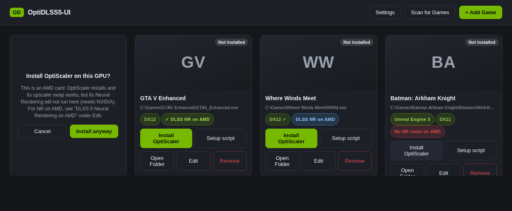
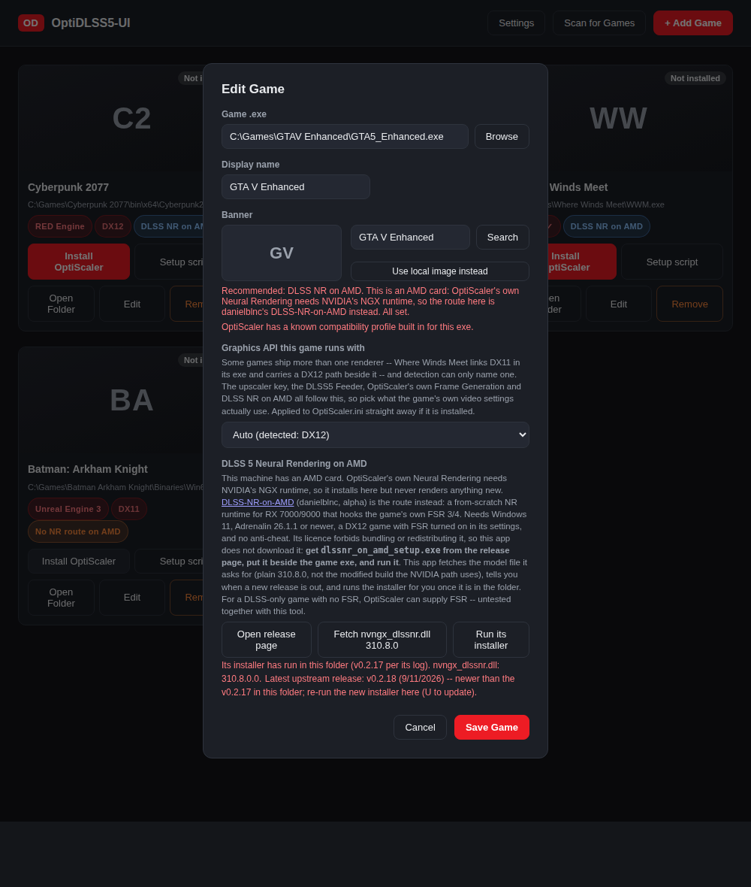
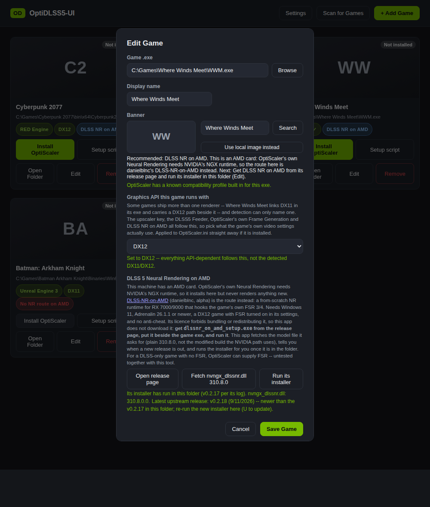
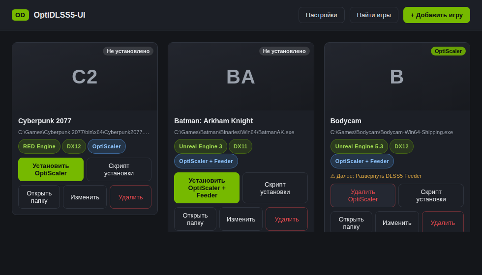
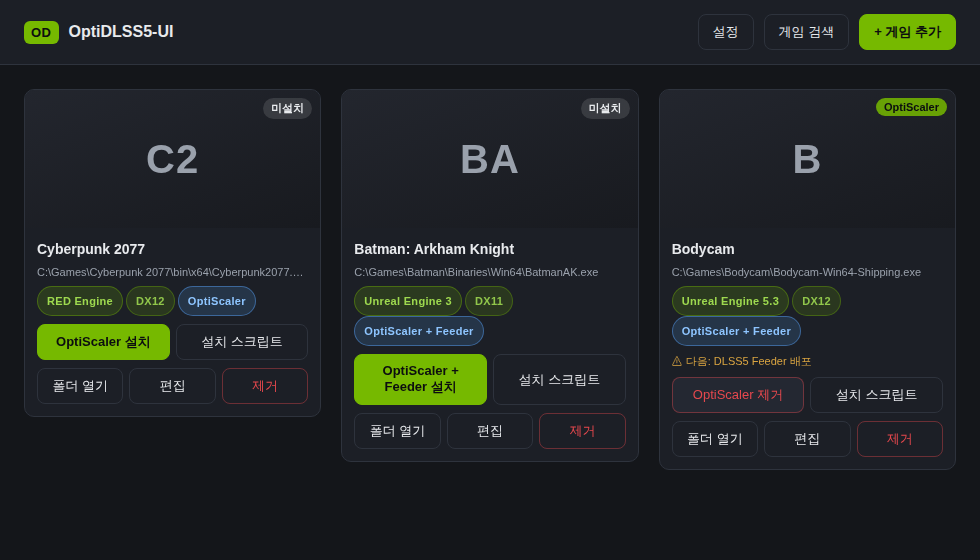
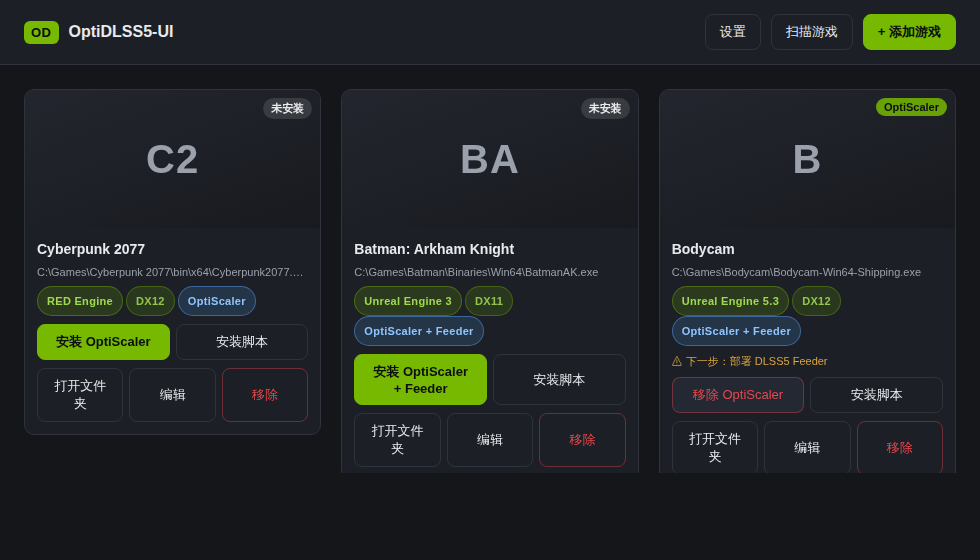
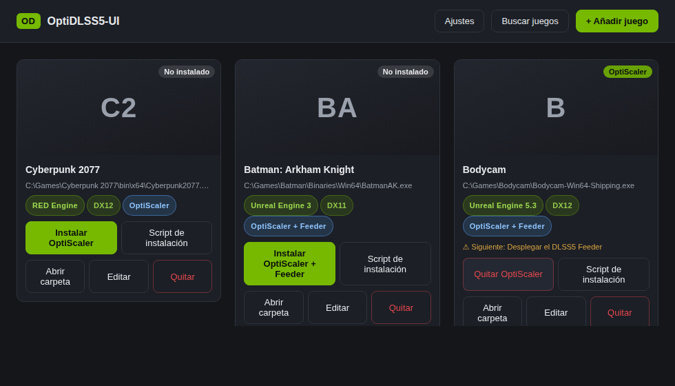
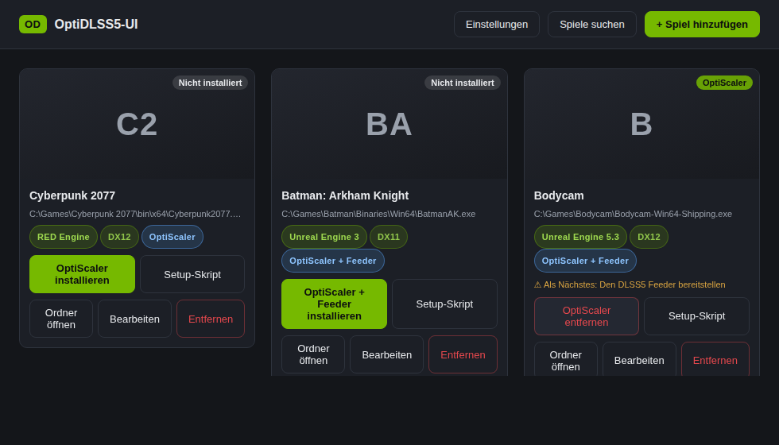

# OptiDLSS5-UI

[](https://buymeacoffee.com/ripplingsnake)

A Windows desktop app for getting NVIDIA's DLSS 5 Neural Rendering into your games via the
[OptiScaler_DLSSNR](https://github.com/mrcgibb9876-hash/OptiScaler_DLSSNR) build of OptiScaler.

Instead of copying files into every game folder by hand and running a setup script in each one, you
point the app at your games once and click Install.

> **Users:** [README-END-USER.txt](README-END-USER.txt) is the step-by-step setup guide, and it
> ships inside the installer as `README.txt`. This file is about how the app works and why.

## Screenshots

**The manager itself** — each card shows whether OptiScaler is active on that game (not a generic
"Installed"), the Install button becomes Remove once it's there, and known trouble conditions
surface right on the card (a badge for the engine or graphics API it detected, or a warning like
the missing-NR-file one below):


**Editing a game** covers per-game Neural Rendering source, Frame Generation, and — for a game with
no native DLSS of its own (checked beside the exe and, for an Unreal game, under the plugin tree where UE keeps it — a game that ships DLSS there is never offered the Feeder) — the DLSS5 Feeder deploy and its two Frame Generation options
side by side (OptiScaler's own FSRFG where it can run, Lossless Scaling where it can't).
For a game that ships NVIDIA's own DLSS Frame Generation (Cyberpunk, Stellar Blade, Witcher 3…)
the same modal sets its **multiplier** — game setting, 2x, 3x, 4x, or Dynamic — without replacing
the game's frame gen: OptiScaler rewrites what the game asks the driver for, the game's own menu
still turns it on and off, and the Alt+Home panel shows the same control live:


**In-game tuning** is OptiScaler's own native panel (`Alt+Home`), the DLSS 5 Developer Controls
overlay — global model controls, per-model style/intensity, Frame Generation (including the
Lossless Scaling row, live over the running game), and the colour/HDR pipeline. It ships in light
and dark themes:


**On an AMD card** the app detects the GPU, wears AMD red instead of NVIDIA green, and routes
differently (see [DLSS NR on AMD](#dlss-nr-on-amd-rx-7000--9000) below). Each DX12 card gets a "DLSS NR on AMD" tag,
a DX11 game says there is no Neural Rendering route on AMD yet, and Install warns that OptiScaler's
own Neural Rendering will not run on this GPU before it does anything. These three are **mock-ups
rendered from the real app code with stubbed data**, not captures from an AMD machine -- phase 1
was built without one, and screenshots from a real RX 7000/9000 are welcome:



**The Edit Game dialog on an AMD card** adds a "DLSS 5 Neural Rendering on AMD" section: whether
the tool's installer has run in this folder and which version its log names, whether the model file
it asks for (`nvngx_dlssnr.dll` 310.8.0) is beside the exe, and whether a newer upstream release is
out. The buttons open the official release page, fetch that model file, and run the installer once
you have placed it:



**Games that ship more than one renderer** (Where Winds Meet links DX11 in its exe and carries a
DX12 path beside it) get a "Graphics API this game runs with" choice. Detection can only name one;
you pick what the game's own video settings actually use, and the upscaler key, the Feeder,
OptiScaler's Frame Generation and DLSS NR on AMD all follow it. The card's API chip shows the
choice with a tick:



See [README-END-USER.txt](README-END-USER.txt) for the full key list and setup steps.

## DLSS NR on AMD (RX 7000 / 9000)

OptiScaler_DLSSNR's Neural Rendering pass runs through NVIDIA's NGX runtime, which only exists with
an NVIDIA driver. On an AMD or Intel card every route this app offers installs cleanly and then
renders nothing new. Since v1.15.0 the app knows which GPU it is on (read from Electron's own GPU
process, shown in Settings) and says so up front: OptiScaler still installs on any GPU -- its
upscaler swap and FSR frame generation are vendor-neutral -- but the card flips to a warning first,
and Intel gets a plain "no Neural Rendering route" tag.

For AMD there *is* a route: [DLSS-NR-on-AMD](https://github.com/danielblnc/DLSS-NR-on-AMD) by
danielblnc, a from-scratch reimplementation of the Neural Rendering runtime for RDNA3/RDNA4 (HIP
kernels, its own game integration) that hooks the game's own FSR 3/4 and runs NVIDIA's model file
on top. It **replaces** this app's NVIDIA stack rather than joining it: the game runs FSR, the
tool's proxy DLL sits beside the exe, and your own `nvngx_dlssnr.dll` goes next to it. It is alpha
(daily releases, open crash reports on several games) and needs Windows 11, Adrenalin 26.1.1 or
newer, a DX12 game with FSR turned on, and no anti-cheat. Vulkan is planned upstream.

**What this app does for it today (phase 1):**

- routes every DX12 game on an AMD card to it, with the reason on the card and in Edit;
- detects an install in the game folder (its setup exe and its log, the only file names its README
  documents) and reads the version from the log;
- fetches the model file the tool asks for -- the **unmodified 310.8.0** build -- from RHI's
  manifest by exact version, and offers a backed-up replace when a different version is there;
- checks the tool's latest GitHub release and says when a newer one is out;
- opens the official release page, and runs the installer in a console once it is in the folder;
- pre-ticks Luma's AMD/Intel ini workaround.

**What it deliberately does not do: download the tool.** Its licence forbids redistributing or
bundling it with "another mod, tool, launcher, installer, package, or download" and says to link
to the release page instead, and its installer is interactive with no documented silent switch.
The author has been asked about both ([DLSS-NR-on-AMD #151](https://github.com/danielblnc/DLSS-NR-on-AMD/issues/151));
until then you download `dlssnr_on_amd_setup.exe` yourself, put it beside the game exe, and the
app does everything around that. Whether it runs alongside OptiScaler (as the FSR provider for a
DLSS-only game) is unverified upstream.

## Language

The manager runs in English, Brazilian Portuguese, Russian, Korean, Simplified Chinese, Spanish or
German. It follows Windows by default (any Portuguese locale gets pt-BR, any Chinese locale gets
zh-CN, and so on) and Settings has a Language selector to pin one. Every string the manager draws
goes through `src/renderer/i18n.js`; a language is one flat file under `src/renderer/locales/`
mapping the English text to its translation. Anything a file does not cover falls back to English.

The in-game DLSS 5 panel (Alt+Home) speaks the same seven languages from engine v1.0.11. It follows
Windows by default too; when you pin a language in the manager's Settings, the manager writes
`[DlssNr] Language` into every installed game's `OptiScaler.ini` so the panel follows suit, and the
panel's own Appearance section has the same selector for a per-game choice. Chinese and Korean draw
with the fonts Windows ships (Microsoft YaHei, Malgun Gothic); nothing extra is bundled. OptiScaler's
own shared menu stays English.

The same three games, seven ways. Mock-ups rendered from the real UI with stub data, like the AMD
ones above.

| | |
|---|---|
|  English |  Português (Brasil) |
|  Русский |  한국어 |
|  简体中文 |  Español |
|  Deutsch | |

Translations welcome. The existing files were written by the maintainer's tooling, not by native
speakers, so corrections to any of them are as useful as new languages. To add one, copy
`src/renderer/locales/pt-BR.js`, translate the right-hand side of each line (keep the `{placeholders}`
and HTML tags exactly as they are), register it under its own code, and add it to the selector and
script list in `src/renderer/index.html` and to `detect()` in `i18n.js`.

## Frame Generation for games with no DLSS of their own

OptiScaler's own Frame Generation (FSRFG) needs the game's swapchain to be D3D12, and can't run
together with the DLSS5 Feeder at all — confirmed on a real crash, not a guess (the Feeder's own
per-frame state isn't built to survive it). For a Feeder game, or any D3D11 game, the app instead
offers [Lossless Scaling](https://store.steampowered.com/app/993090/Lossless_Scaling/) as the
Frame Generation source: a separate app that generates extra frames from the game's own window
from the outside, so it never touches the swapchain OptiScaler, ReShade, and the Feeder share.

It is offered for **every** game, not just Feeder or DX11 ones — sometimes it is simply the better
choice. **Lossless Scaling is a separate paid app you need to own yourself** — Steam is its
distribution — this app doesn't install it, only configures its per-game profile once you do. From
the Edit Game modal: pick **Fixed** (2x/3x/4x every frame) or **Adaptive** (a target FPS it
generates just enough frames to hold), **Configure for this game**, then **Launch Lossless
Scaling**. After that, the on/off toggle (and the multiplier, in Fixed mode) lives in this game's
own in-game panel (`Alt+Home`) — no need to alt-tab out during play; in Adaptive mode the panel
shows the target it is holding.

**Requires the game running Borderless or Windowed, not exclusive Fullscreen** — Lossless Scaling
cannot capture an exclusive-fullscreen window at all, a limitation on its own side. A DX12 game is
usually fine either way, since DX12 has no true exclusive fullscreen.

## What it does

**Finds your games.** Reads Steam's `libraryfolders.vdf` (so every Steam library on every drive),
the Epic and GOG registry entries, and — on request — every fixed drive on the machine. You can add
folders by hand and exclude ones you never want walked. For each game folder it picks the executable
to install beside, scoring on name match, the directory a shipping binary tends to live in, and how
deep it sits, and penalising launchers, crash reporters, updaters and anti-cheat wrappers. It
proposes; you confirm before anything is written.

The drive scan is off by default. On a 4 TB library it takes real time, so it belongs behind a
checkbox you tick rather than on first run.

**Installs OptiScaler per game.** Copies the release files and your NR model file into the game
folder, tracks what's installed against what's current, and re-runs OptiScaler's own setup script
in a console you confirm yourself.

**Ships the OptiScaler_DLSSNR engine build inside the installer** (`release.yml` fetches the
fork's latest release into `engine/` before packaging; it lands in `resources/engine/`), extracts
it on first launch, and keeps it current from GitHub on every launch and "Check for Updates". The
same zip is also attached to this app's own GitHub releases (as `OptiScaler_DLSSNR-<version>.zip`)
for anyone setting the release folder by hand. **The DLSS NR model file** (`nvngx_dlssnr.dll`,
the one piece NVIDIA only ships inside driver packages) is fetched automatically too, from the
same RHI manifest the Feeder already uses -- a fresh install needs no manual downloads at all.

**A second engine build: OptiScaler-DLSSNR-PreSR-Multipass.** Settings > "OptiScaler build" (and
per game, Edit > "OptiScaler build for this game") can switch from this project's own
OptiScaler_DLSSNR to [wilsjo2's PreSR-Multipass fork](https://github.com/wilsjo2/OptiScaler-DLSSNR-PreSR-Multipass).
Both builds can run Neural Rendering *before* DLSS upscaling (`[DlssNr] RunBeforeSR`), so the
model works on the DLSS input (1920x1080 in 4K Performance) rather than the full output frame -- a
large speed-up at the same output resolution -- and both stack one to three passes (`Passes`).
The fork keeps more games on that path: a colour image padded inside a larger texture (2558x1439
in 2560x1440, or a max-size allocation under dynamic resolution) stays pre-upscale there, where
OptiScaler_DLSSNR falls back to after upscaling. It also carries experimental extras
(finished-picture NR, a pre-SR edit carried across Ray Reconstruction). It has no Alt+Home DLSS 5
panel; its controls live in OptiScaler's own Insert menu. It is fetched from its own GitHub
releases the first time a game needs it (sha256 checked against the release's own checksum
file), kept in its own managed folder beside the default build, and updated on the same schedule.
The Pre-SR block in Edit writes `RunBeforeSR` and `Passes` for either build, on Apply and on
Install; after that the in-game menu owns them. Installing the fork turns `RunBeforeSR` on unless
you chose otherwise. Switching an installed game between builds is a re-Install from the card;
Remove clears either.

## What OptiScaler covers, and what it doesn't

OptiScaler intercepts the game's own upscaler — NVNGX, FSR or XeSS — and hands the neural model a
properly labelled depth buffer, motion vectors, motion-vector scale, reset flag and pre-exposure
straight from the parameter block. It covers **D3D12 natively, Vulkan (natively and through the
VkOnDx12 bridge), and D3D11 through the Dx11wDx12 bridge**. There is no D3D9 or D3D10 code in
OptiScaler and there isn't going to be — those APIs have nothing to intercept, so games on them are
simply not supported by this app. The card says so plainly instead of recommending an install that
can't work.

## Dependencies: what the app fetches, and the one thing it won't

**Streamline** — the `streamline` folder OptiScaler's DLSS-G Frame Gen needs — is downloaded per
game when the game doesn't already ship one. The version list comes from RHI's published
`dlss_manifest.json`, so a newer Streamline build reaches you the day RHI packages it, without
waiting for a release of this app. "Latest" is the default; Settings has a dropdown if you want to
hold a specific build, and a game with a known ceiling (The Witcher 3 hard-crashes on 2.12.0 and
newer) is capped automatically. Only the Streamline DLLs are taken from RHI — the OptiScaler build and the DLSS-NR model
stay pinned to our own `OptiScaler_DLSSNR` fork.

**REFramework** is fetched from `praydog/REFramework-nightly` for RE Engine games, where OptiScaler
does nothing without it. The install fails rather than half-succeeds if it can't be got.

**The DLSS NR model file** (`nvngx_dlssnr.dll`) is NVIDIA's and only ships inside driver packages,
which is why `package_release.ps1` leaves it out of the OptiScaler release. It is not bundled here
either; the app fetches it on first launch from the same RHI manifest the Feeder uses, or you can
point Settings at your own copy from a driver. Two builds exist in that manifest and the app uses
both, on purpose:

- **310.8.SF** (what the NVIDIA path deploys by default) is [ShortFuse](https://github.com/ShortFuse)'s
  modified build that extends Neural Rendering to RTX 20, 30 and 40 Series cards; NVIDIA's own
  build only runs on RTX 50. It reports itself as 310.8.1. Worth knowing: it is a third-party
  modification of an NVIDIA DLL.
- **310.8.0**, the unmodified build, is what DLSS-NR-on-AMD documents, so that is the one the AMD
  section fetches, by exact version.

**DLSS-NR-on-AMD itself is never downloaded** -- see the section above for why.

## Verified games

The card shows a "✓ Verified" tick when a game's route has been confirmed end to end on a real
install -- Neural Rendering actually dispatching in gameplay -- and recorded in
[`src/verified-games.json`](src/verified-games.json). That file is also where the app learns
which route a game defaults to when a specific mod has been proven there (Luma UE on Fallen
Order) and which routes are known to break a game (Luma UE on Spyro). It is data, not code:
confirm a game yourself, then add an entry by pull request with the date, the route, and what
a player should know.

## Launching a game

Every card has a **Launch** button. A game installed under a Steam library is launched through Steam (by the
appid of its install folder), so its DRM, overlay and launch options behave as usual. Any other game runs from
its own folder, and for an Unreal game that means the
`<Project>-Win64-Shipping.exe` under `<Project>BinariesWin64` -- the process that actually renders and the one
OptiScaler is installed beside -- even when the card was added from the launcher stub in the install root.

## Game Help

Every card has a **Game Help** button. It checks what the app already knows about the game -- the
detection, the recommended route and what is deployed, the last run's verdict from the logs, other
DLSS 5 toolchains in the folder, the verified-games registry -- against a rule table
(`src/gamehelp.js`) and says one of six things:

- **Working** -- Neural Rendering ran on the last run, with the pass count and fps.
- **Fix available** -- the app can do it: remove another toolchain, remove a Feeder that is on a game
  with its own DLSS, remove Luma UE from a game known to break with it, reconfigure the ini
  (`dlss_12` for D3D11, NR on, REFramework for RE Engine, the Feeder's ReShade settings), or Install.
  One button applies it.
- **Your move** -- something only you can do in-game, such as selecting DLSS in Luma's overlay.
- **Needs a run** -- no log yet. **Launch and check** starts the game and reads the new log by itself
  once you have reached gameplay and quit.
- **Not available** -- DLSS 5 cannot work here with what this app deploys: a 32-bit game, anti-cheat,
  a Vulkan-only game with no DLSS, or a fix that was applied and changed nothing. It says why.
- **No rule fits** -- the escalation: **Save bundle to share** zips the logs, settings and the app's
  own view to your Desktop (nothing is sent anywhere), or **Ask AI**.

**Ask AI** is optional and paid by you: in Settings, paste an Anthropic API key (you pay Anthropic
directly for what you use). It sends that game's log tails and the app's view to Claude, which may
apply only the same fixes the app has, and only after you confirm each one in a dialog. It ends with
a plain verdict: fixed, or "DLSS 5 is not currently available for this game" and why. Nothing is sent
until you press Ask AI, and the key never leaves your machine except to api.anthropic.com.
## In-game keys

| | |
|---|---|
| **Insert** | OptiScaler's own overlay |
| **Alt+Home** | the DLSS 5 Developer Controls panel |

Both are rebindable, and both panels can be open at once. The panel moved off bare `Home` in
v1.0.1 because `Home` collided with too many games; v1.0.0 still uses it.

**Moving and resizing the DLSS 5 panel** (engine v1.0.14; resizing from v1.0.18): hold the left
mouse button on its background, away from any slider or checkbox, and drag it anywhere. It can hang
partly off the screen, but a strip always stays visible to grab it back. Drag any edge or the
bottom-right corner to resize it; a panel smaller than its content scrolls. Position and size are
remembered for that game, as fractions of the screen, so they come back at any resolution. A
**Reset layout** button in its title row puts it back on the left edge at its natural size, and the
bright red **X** at the far right of the title row closes it (its key opens it again).

**RE Engine games** (Dragon's Dogma 2, the Resident Evil titles, Monster Hunter Rise/Wilds, and
the rest of Capcom's RE Engine catalogue) also need REFramework, which uses Insert for its own
overlay. On these games the app switches OptiScaler's own overlay key to **Alt+O** automatically,
so both work side by side without a manual rebind.

**Resident Evil 2, 3, 4, 7 and Village** have no DLSS of their own. Install fetches REFramework's
pd-upscaler build and `nvngx_dlss.dll`; the one file it cannot fetch is PureDark's free **Upscaler
Base Plugin** (`PDPerfPlugin.dll`), which is only on
[Nexus Mods](https://www.nexusmods.com/site/mods/502) and is PureDark's to distribute. The card's
**Get plugin** button (it also pops up after installing one of these games) opens that page, then
finds the download in your Downloads folder -- `.zip`, `.7z`, `.rar` or the DLL itself -- or takes
one you browse to. It is imported once and placed in every one of these games, including ones you
install later; Remove takes it back only where it is still the copy the app placed. In-game:
Insert opens REFramework -> TemporalUpscaler -> Enabled, Upscale Type DLSS.

## Building

```
npm install
npm start          # run it
npm run dist       # NSIS installer + portable .exe, into dist/
```

Electron 33, Windows x64. No native modules.

## Credits and licensing

`src/library.js` is taken verbatim from [DLSS5-Swapper](https://github.com/rakanki911/DLSS5-Swapper)
— MIT, Copyright (c) 2026 Rakan Alkhaldi. The licence text is kept alongside it in
[LICENSE-DLSS5-Swapper.txt](LICENSE-DLSS5-Swapper.txt); keeping that notice is the whole of what MIT
asks. It is held byte-identical to its upstream so it can be refreshed without a merge — the
adaptation for this app lives in `src/discover.js` instead.

[OptiScaler](https://github.com/optiscaler/OptiScaler) is the upstream this all rests on, through
the [OptiScaler_DLSSNR](https://github.com/mrcgibb9876-hash/OptiScaler_DLSSNR) fork that adds the
Neural Rendering pass and the in-game panel.

Everything the app fetches on your behalf comes from someone else's work, live from their own
releases and never mirrored here:

| Project | Used for | Licence |
|---|---|---|
| [DLSS-NR-on-AMD](https://github.com/danielblnc/DLSS-NR-on-AMD) (Daniel Blanco) | Neural Rendering on RX 7000/9000 -- detected, linked and configured around; not downloaded | Custom, personal non-commercial; no redistribution or bundling |
| [RHI](https://github.com/RankFTW/RHI) (RankFTW) | `dlss_manifest.json`: Streamline, DLSS, DLSS-G and NR model packages (read, not linked against) | GPL-3.0 |
| ShortFuse's `nvngx_dlssnr.dll` 310.8.SF (via RHI) | Neural Rendering on RTX 20/30/40 | Modified NVIDIA DLL, as published by RHI |
| [DLSS5-Feeder](https://github.com/jlrouzies-fr/DLSS5-Feeder) (jlrouzies-fr) | A synthesised DLSS call for games with no DLSS of their own | MIT |
| [ReShade](https://reshade.me) (crosire) and [reshade-shaders](https://github.com/crosire/reshade-shaders) | Host for the Feeder and Luma add-ons; `ReShade.fxh`/`ReShadeUI.fxh` | BSD 3-Clause |
| [ReshadeMotionEstimation](https://github.com/JakobPCoder/ReshadeMotionEstimation) (JakobPCoder) | Default motion-vector provider for the Feeder | CC BY-NC 4.0 |
| [LumeniteFX](https://github.com/umar-afzaal/LumeniteFX) (umar-afzaal) | Optional motion-vector provider; fetched live from the official repo only after per-action consent | AGNYA (all rights reserved) |
| [Luma-Framework](https://github.com/Filoppi/Luma-Framework) (Filoppi) | DLAA in place of TAA for STAR WARS Jedi: Fallen Order; fetched live after per-action consent | Custom MIT variant |
| [OptiScaler-DLSSNR-PreSR-Multipass](https://github.com/wilsjo2/OptiScaler-DLSSNR-PreSR-Multipass) (wilsjo2) | Optional engine build: Neural Rendering before DLSS upscaling, 1-3 passes; fetched live from its releases | GPL-3.0 |
| [REFramework](https://github.com/praydog/REFramework) (praydog) | Required on RE Engine games | MIT |
| [Upscaler Base Plugin](https://www.nexusmods.com/site/mods/502) (PureDark) | The DLSS call on Resident Evil 2/3/4/7/Village; downloaded by the user from Nexus, then imported and placed by the app -- never downloaded or shipped by it | PureDark's; not redistributed |
| [Lossless Scaling](https://store.steampowered.com/app/993090/Lossless_Scaling/) (THS) | Frame Generation for games with no DLSS of their own; configured, never installed | Paid, Steam |
| [DLSS5-Swapper](https://github.com/rakanki911/DLSS5-Swapper) (Rakan Alkhaldi) | `src/library.js`, as above | MIT |

NVIDIA's DLSS is NVIDIA's; this project is not affiliated with or endorsed by NVIDIA, AMD, or any of
the projects above.
