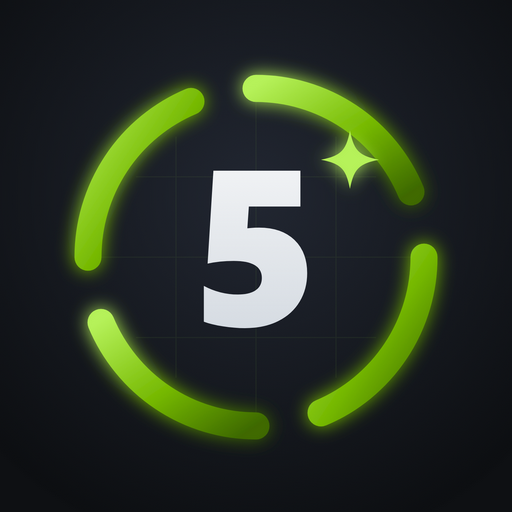
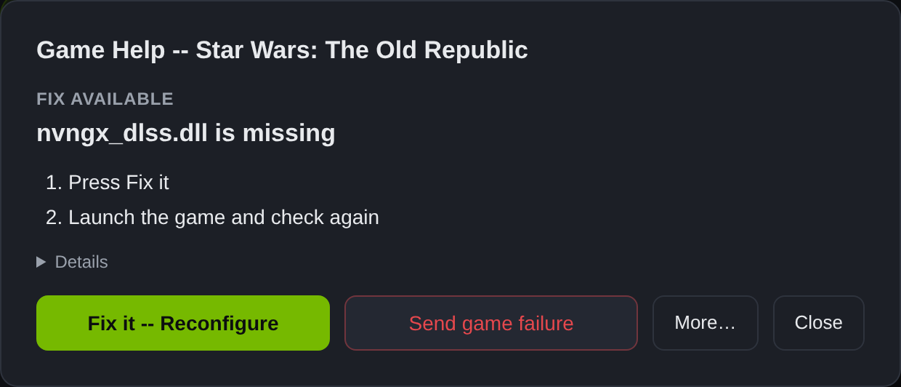
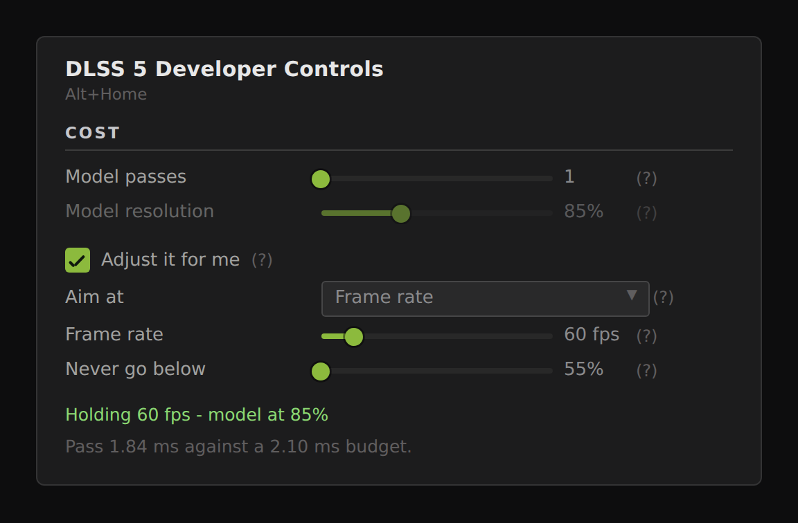

<p align="center">
  
</p>

<h1 align="center">OptiDLSS5-UI</h1>

<p align="center"><b>DLSS 5 Neural Rendering, set up per game.</b></p>

<p align="center">
  <a href="https://discord.gg/HFZTDdSNmJ"></a>
</p>

<p align="center">
  <a href="https://github.com/mrcgibb9876-hash/OptiDLSS5-UI-releases/releases/latest"></a>
  <a href="https://discord.gg/HFZTDdSNmJ"></a>
  <a href="https://buymeacoffee.com/ripplingsnake"></a>
</p>

> [!TIP]
> **Need help, or want to show off a game?** Join the **[OptiDLSS5-UI Discord](https://discord.gg/HFZTDdSNmJ)**: a help forum,
> per-game results, before/after screenshots, and every release announced as it lands.

A Windows app that puts NVIDIA's DLSS 5 Neural Rendering into your games through the
[OptiScaler_DLSSNR](https://github.com/mrcgibb9876-hash/OptiScaler_DLSSNR) build of OptiScaler. Add your
games, press **Install**, play. The app works out what each game needs and sets it up.

> Step-by-step setup for players: [README-END-USER.txt](README-END-USER.txt) (ships in the installer as `README.txt`).

## Screenshots

**Your library.** One card per game, and the card says the whole story: the engine, the graphics API, the
route that game gets, a ✓ when someone has confirmed that route on this game, and what the last run did.

The chip at the top and the big button underneath always agree, because they are decided together — there is
one next step at a time, and it is the button. Everything else moved behind the ⋯ menu.


- **Working** — the neural pass ran, and the line beside the chips is the evidence: passes, frame rate, API.
- **Set up** with something to fix — the card names the problem and the button applies the fix.
- **Running** — while the game is up the card says how to reach the panel instead of offering a fix, because
  a fix would move DLLs the game is holding open.
- **Not installed**, **Leftovers**, **Exe missing** — each with the one button that belongs to it.

**Game Help** reads the game's own logs and says what to do in a few steps. When the app can fix it, the fix
is one button — on this dialog, and on the card itself. The long explanation is under Details.



**In game**, `Alt+Home` opens the DLSS 5 Developer Controls panel. Every DLSS 5 control lives here rather than
in the manager, so a change lands on the frame you are looking at.


**New in v2.1.0 — adaptive model resolution.** Tell it a frame rate and the neural pass holds itself to it,
moving how hard the model works as the scene changes. It only ever changes the *model's* resolution — the
frame is never reduced — it will not go below a floor you set, and when the frame rate you asked for is out
of reach it says so rather than sitting at the floor looking broken. Off by default.



## Community and support

[](https://discord.gg/HFZTDdSNmJ)

- **[#help](https://discord.gg/HFZTDdSNmJ)**: post the game, your GPU and what Game Help said.
- **#game-results**: what works, on which route, with which settings.
- **#screenshots**: before/after shots with DLSS 5.
- **#announcements**: every release as it ships.

Found a bug? Press **Send game failure** in Game Help. It files a GitHub issue with your logs attached.

## Requirements

- Windows 10/11, 64-bit.
- An NVIDIA RTX card (20 to 50 series) and **driver 616.56 or newer**. Game Help says so when the driver is older.
- AMD RX 7000/9000: see [AMD](#amd-rx-7000--9000). Intel has no Neural Rendering route.

## What it does for you

- **Finds games:** Steam (every library), Epic and GOG, and optionally every drive. It picks the exe that
  actually renders, skipping launchers, crash reporters and anti-cheat wrappers.
- **Installs everything a game needs in one click:** the engine, the NR model, and whatever the route needs.
  All of it is recorded, so **Remove** puts the folder back exactly as it was.
- **Keeps itself current:** the engine ships inside the installer, and the NR model is fetched on first launch.
  Engine, model and app update on their own, and **Check for Updates** in the top bar forces a check.
- **Checks the result:** after a run, the card and Game Help read OptiScaler's and the Feeder's logs and name
  the problem: driver too old, model crash, no motion vectors, flat depth, another DLSS 5 tool in the folder,
  and so on. Most findings come with a **Fix it** button.

## Routes

The card names the route. You don't choose it.

| Game | Route |
|---|---|
| Ships its own DLSS (Cyberpunk, Witcher 3, Stellar Blade...) | **OptiScaler**: Neural Rendering on the game's own DLSS |
| No DLSS of its own | **OptiScaler + DLSS5 Feeder**: the Feeder builds a DLSS call from ReShade depth and motion vectors ([VORT](https://github.com/vortigern11/vort_Shaders) by default) |
| Resident Evil 2 / 3 / 4 / 7 / Village, Devil May Cry 5, SF6 | **Present route**: DLSS 5 at the end of each frame, depth found by the engine ([DXL](https://github.com/LCPD15/DXL)'s design). Nothing extra to download |
| Any game [Luma-Framework](https://github.com/Filoppi/Luma-Framework) has a DLSS mod for (Monster Hunter: World, Prey, Just Cause 3, Final Fantasy XV, Mafia III...), plus Fallen Order | **Luma**: the mod adds a real DLSS call with the game's own motion vectors, set up on DirectX 11. The list is read from Luma-Framework's GitHub release every day, so new mods are picked up automatically. A game whose own DLSS predates 2.0 (MHW ships 1.1.13) gets Luma too. Install offers it, after you confirm its licence |
| Emulators, 32-bit games, DirectX 8/9 | **Experimental**: Feeder route. 32-bit games run DLSS in a 64-bit helper beside the game; DX8/9 go through dgVoodoo2 (asked before download, because Defender flags its zip) |

Games that offer both **DX12 and DX11 are set up for DX12**. The one exception is when OptiScaler's log shows
the game really ran DX11.

## Frame Generation

- **The game's own DLSS Frame Generation:** set the multiplier (2x/3x/4x/Dynamic) in Edit or live in the panel.
- **RTX 40 / 30:** [RTXMFG](https://github.com/dashdogy/RTX40MFG-Unlock) unlocks 3x–6x and Dynamic. It shows
  in Edit for every game with DLSS Frame Generation. The app fetches it and checks it against its checksums;
  press Backspace in game for its menu.
- **Games with no DLSS:** [Lossless Scaling](https://store.steampowered.com/app/993090/Lossless_Scaling/) (a
  separate paid app) is configured per game and toggled from the panel. It needs borderless or windowed mode.
  OptiScaler's own FSR frame generation is D3D12-only and can't run alongside the Feeder.

## In game

| Key | Opens |
|---|---|
| `Alt+Shift+Home` | The app's own pop-out DLSS 5 panel, on top of the game (see below) |
| `Alt+Home` | DLSS 5 Developer Controls panel (drag to move, drag an edge to resize, **Reset layout** in its title) |
| `Insert` | OptiScaler's own menu (`Alt+O` on RE Engine games, where REFramework uses Insert) |
| `Home` | ReShade, on Feeder routes |

All of them are rebindable. Settings changed in the app are written to the game's `OptiScaler.ini`. On the 32-bit
route the game reads them live, because its panel sits in the helper: Home > Add-ons > DLSS 5 Feed > *Show the
DLSS 5 panel in-game* > Insert.

### The pop-out panel

The panels above are drawn inside the game, so they depend on the game cooperating: some games swallow `Alt+Home`,
and a 32-bit game only ever shows a mirror of the 64-bit helper's panel, which is why it can appear and then do
nothing when you click it.

`Alt+Shift+Home` opens a small window of the app's own instead, always on top of the game, resizable, with
**every** DLSS 5 control in it — the same rows as the Edit dialog and the in-game panel, from the same source, plus
a readout of what the model's resolution and pass count cost. Nothing is asked of the game: the hotkey is
registered with Windows, and the controls write to `OptiScaler.ini`, which the engine re-reads within a second. It
opens on whichever of your games is running. Settings has a switch for it, a box to rebind the key by pressing it,
and a button to open it now.

It is not a Windows dialog and it is not styled like the manager: it is **the in-game panel, outside the game** —
the same sections in the same order, the same rows with the same labels, drawn in the engine's own palette
(sampled off NVIDIA's panel, and converted straight from the constants in `DlssNr_Menu.cpp`). No title bar; drag
it by its top bar, resize it from any edge, and it comes back where you left it. Its **Light panel** and **Vendor
colours** switches are `[DlssNr] LightTheme` and `VendorColours`, so the two panels always agree about how they
look.

What it does not carry is the handful of in-game rows that act on a frame being drawn right now — *Capture 8
frames*, *Anchor here*, *Show Mask*, the frame-generation state readout. Those have no ini key to write, so a
window outside the game has nothing to say for them.

The one thing it cannot do is sit on top of a game in **exclusive fullscreen** — Windows will not composite
another window over a game that owns the display. Run that game borderless or windowed (`[DlssNr] ForceBorderless`
does it for you).

**Launch** starts a Steam game through Steam. A game behind an anti-cheat stub (EasyAntiCheat, BattlEye) is
started from its own exe instead, after asking. That means single-player only: going online with these files
can get an account banned, so use **Remove** first.

To keep a working game exactly as it is, put an empty `.dlss5ui-keep-as-is` file beside its exe. Sync will then
leave it alone.

## AMD (RX 7000 / 9000)

OptiScaler's Neural Rendering needs NVIDIA's NGX runtime. On AMD, Edit offers
[DLSS-NR-on-AMD](https://github.com/danielblnc/DLSS-NR-on-AMD) (danielblnc, alpha) instead. It hooks the game's
FSR 3/4 and needs Windows 11, Adrenalin 26.1.1+ and a DX12 game with FSR on. The app fetches the model it asks for
(the unmodified 310.8.0), watches for new releases and runs its installer. Its licence forbids redistribution,
so **you download `dlssnr_on_amd_setup.exe` yourself** and put it beside the game exe.

## Languages

English, Português (Brasil), Русский, 한국어, 简体中文, Español, Deutsch and Français. The app follows Windows,
and Settings can pin a language, which the in-game panel then follows too. Translations are one flat file each
in `src/renderer/locales/`, written by the maintainer's tooling. Corrections from native speakers are welcome.

## Verified games

A ✓ on a card means the route was confirmed end to end on a real install and recorded in
[`src/verified-games.json`](src/verified-games.json). That file also sets per-game default routes and known-bad
routes. Add a game you've confirmed by pull request.

## Building

```
npm install
npm start          # run
npm test           # node:test suite
npm run dist       # NSIS installer + portable exe in dist/
```

Electron 33, Windows x64, no native modules. Setting `OPTIDLSS5_NO_SYNC=1` runs a copy that never touches game
folders, which is useful for screenshots or a second instance.

## Credits and licensing

**OptiDLSS5-UI is proprietary, all rights reserved** ([LICENSE](LICENSE), from v1.55.0). You may run the official
releases and propose changes here, but not copy, modify or redistribute the app. The OptiScaler_DLSSNR engine is a
separate program and stays GPL-3.0. Third-party notices: [THIRD-PARTY-NOTICES.md](THIRD-PARTY-NOTICES.md).
`src/library.js` is from [DLSS5-Swapper](https://github.com/rakanki911/DLSS5-Swapper) (MIT, Rakan Alkhaldi;
licence in `third_party/`).

[OptiScaler](https://github.com/optiscaler/OptiScaler) is the upstream this rests on. Thanks to LCPD15 for
[DXL](https://github.com/LCPD15/DXL), whose design the engine's Present route follows. Everything below is
fetched live from its own releases, never mirrored here:

| Project | Used for | Licence |
|---|---|---|
| [DLSS5-Feeder](https://github.com/jlrouzies-fr/DLSS5-Feeder) (jlrouzies-fr) | DLSS call for games without DLSS | MIT |
| [ReShade](https://reshade.me) (crosire), [reshade-shaders](https://github.com/crosire/reshade-shaders) | Host for the Feeder and Luma add-ons | BSD 3-Clause |
| [vort_Shaders](https://github.com/vortigern11/vort_Shaders) (vortigern11) | Default motion vectors for the Feeder (pinned commit) | MIT |
| [LumeniteFX](https://github.com/umar-afzaal/LumeniteFX) (umar-afzaal) | Optional motion vectors, after licence consent | AGNYA |
| [iMMERSE](https://github.com/martymcmodding/iMMERSE) (MartysMods) | Optional motion vectors if you already have it; never fetched | All rights reserved |
| [RHI](https://github.com/RankFTW/RHI) (RankFTW) | Manifest for Streamline, DLSS, DLSS-G and the NR model | GPL-3.0 |
| ShortFuse's `nvngx_dlssnr.dll` 310.8.SF (via RHI) | Neural Rendering on RTX 20/30/40 | Modified NVIDIA DLL |
| [RTXMFG](https://github.com/dashdogy/RTX40MFG-Unlock) (dashdogy) | Multi Frame Generation on RTX 40/30, checksum-verified | MIT |
| [Luma-Framework](https://github.com/Filoppi/Luma-Framework) (Filoppi) | DLAA for Fallen Order, after licence consent | Custom MIT variant |
| [REFramework](https://github.com/praydog/REFramework) (praydog) | Required on RE Engine games | MIT |
| [DXL](https://github.com/LCPD15/DXL) (LCPD15) | Design of the engine's Present route; nothing downloaded | AGPL-3.0 |
| [DLSS-NR-on-AMD](https://github.com/danielblnc/DLSS-NR-on-AMD) (danielblnc) | AMD route; linked, never downloaded | Custom, no redistribution |
| [dgVoodoo2](https://github.com/dege-diosg/dgVoodoo2) (Dege) | DirectX 8/9 to 11 on the experimental route, after asking | Freeware |
| [Lossless Scaling](https://store.steampowered.com/app/993090/Lossless_Scaling/) (THS) | Frame Generation for games without DLSS; configured, never installed | Paid (Steam) |
| [DLSS5-Swapper](https://github.com/rakanki911/DLSS5-Swapper), [DLSS5-Autopilot](https://github.com/Kizzuwatnaa/DLSS5-Autopilot) | `src/library.js`, emulator table, 32-bit helper layout | MIT |
| [Upscaler Base Plugin](https://www.nexusmods.com/site/mods/502) (PureDark) | Retired RE route; only recognised so an old copy can be removed | Not redistributed |

NVIDIA's DLSS is NVIDIA's. This project is not affiliated with NVIDIA, AMD or any project above.

---

<p align="center"><a href="https://discord.gg/HFZTDdSNmJ"><b>💬 Join the OptiDLSS5-UI Discord</b></a></p>
