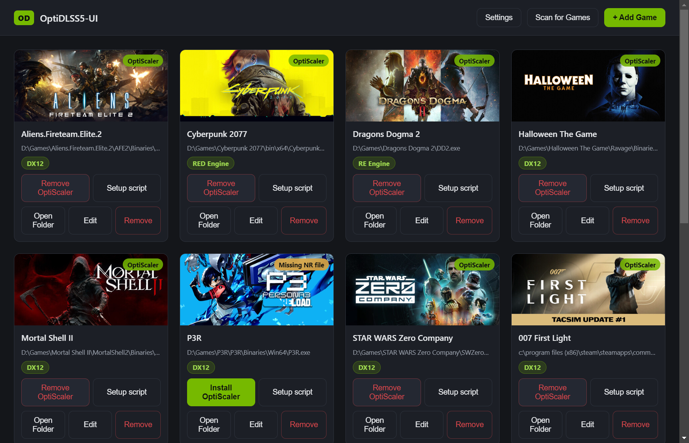
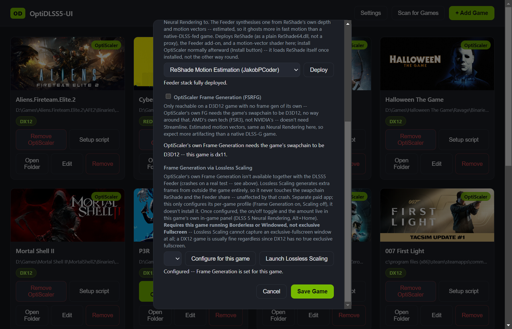
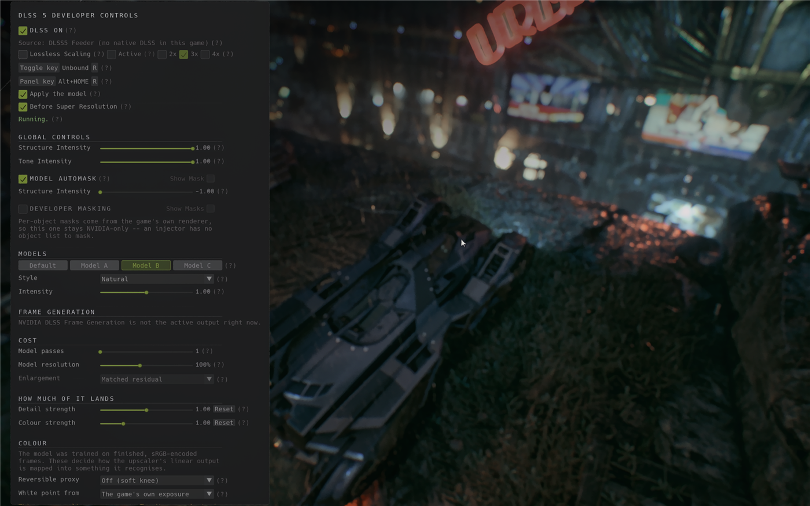
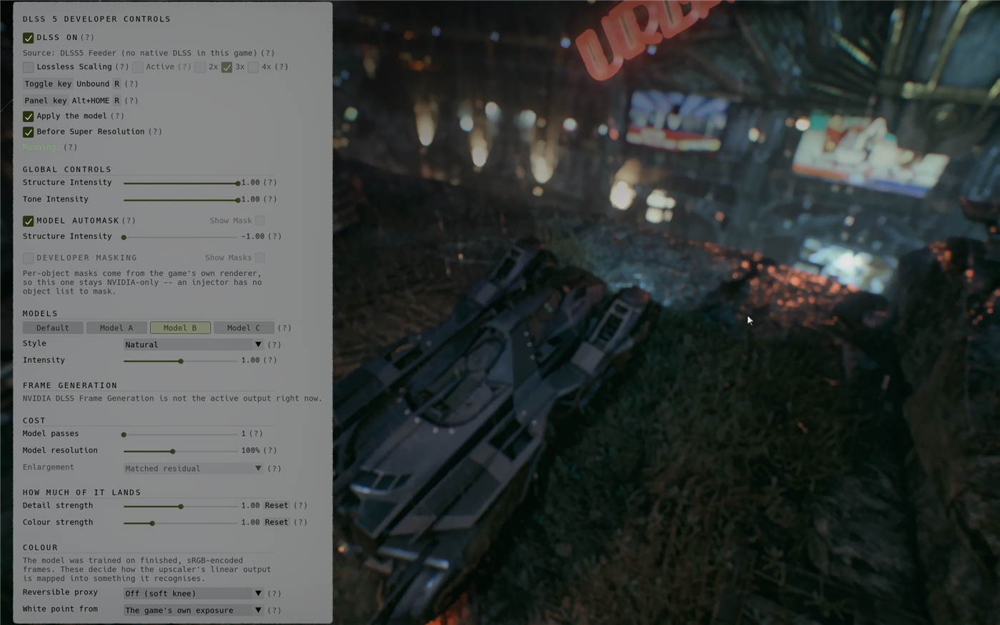

# OptiDLSS5-UI

[](https://buymeacoffee.com/ripplingsnake)

A Windows desktop app for getting NVIDIA's DLSS 5 Neural Rendering into your games via the
[OptiScaler_DLSSNR](https://github.com/mrcgibb9876-hash/OptiScaler_DLSSNR) build of OptiScaler.

Instead of copying files into every game folder by hand and running a setup script in each one, you
point the app at your games once and click Install.

> **Users:** [README-END-USER.txt](README-END-USER.txt) is the step-by-step setup guide, and it
> ships inside the installer as `README.txt`. This file is about how the app works and why.

## Screenshots

**The manager itself** — each card shows whether OptiScaler is active on that game (not a generic
"Installed"), the Install button becomes Remove once it's there, and known trouble conditions
surface right on the card (a badge for the engine or graphics API it detected, or a warning like
the missing-NR-file one below):



**Editing a game** covers per-game Neural Rendering source, Frame Generation, and — for a game with
no native DLSS of its own — the DLSS5 Feeder deploy and its two Frame Generation options
side by side (OptiScaler's own FSRFG where it can run, Lossless Scaling where it can't):



**In-game tuning** is OptiScaler's own native panel (`Alt+Home`), the DLSS 5 Developer Controls
overlay — global model controls, per-model style/intensity, Frame Generation (including the
Lossless Scaling row, live over the running game), and the colour/HDR pipeline. It ships in light
and dark themes:





See [README-END-USER.txt](README-END-USER.txt) for the full key list and setup steps.

## Frame Generation for games with no DLSS of their own

OptiScaler's own Frame Generation (FSRFG) needs the game's swapchain to be D3D12, and can't run
together with the DLSS5 Feeder at all — confirmed on a real crash, not a guess (the Feeder's own
per-frame state isn't built to survive it). For a Feeder game, or any D3D11 game, the app instead
offers [Lossless Scaling](https://store.steampowered.com/app/993090/Lossless_Scaling/) as the
Frame Generation source: a separate app that generates extra frames from the game's own window
from the outside, so it never touches the swapchain OptiScaler, ReShade, and the Feeder share.

**Lossless Scaling is a separate paid app you need to own yourself** — Steam is its distribution —
this app doesn't install it, only configures its per-game profile once you do. From the Edit Game
modal: pick the amount (2x/3x/4x), **Configure for this game**, then **Launch Lossless Scaling**.
After that, both the on/off toggle and the amount live in this game's own in-game panel
(`Alt+Home`) — no need to alt-tab out during play.

**Requires the game running Borderless or Windowed, not exclusive Fullscreen** — Lossless Scaling
cannot capture an exclusive-fullscreen window at all, a limitation on its own side. A DX12 game is
usually fine either way, since DX12 has no true exclusive fullscreen.

## What it does

**Finds your games.** Reads Steam's `libraryfolders.vdf` (so every Steam library on every drive),
the Epic and GOG registry entries, and — on request — every fixed drive on the machine. You can add
folders by hand and exclude ones you never want walked. For each game folder it picks the executable
to install beside, scoring on name match, the directory a shipping binary tends to live in, and how
deep it sits, and penalising launchers, crash reporters, updaters and anti-cheat wrappers. It
proposes; you confirm before anything is written.

The drive scan is off by default. On a 4 TB library it takes real time, so it belongs behind a
checkbox you tick rather than on first run.

**Installs OptiScaler per game.** Copies the release files and your NR model file into the game
folder, tracks what's installed against what's current, and re-runs OptiScaler's own setup script
in a console you confirm yourself.

**Fetches the OptiScaler_DLSSNR engine build automatically** on first launch and on every "Check
for Updates" in Settings. It's also attached directly to this app's own GitHub releases (as
`OptiScaler_DLSSNR-<version>.zip`), so a manual download never means visiting a second repo.

## What OptiScaler covers, and what it doesn't

OptiScaler intercepts the game's own upscaler — NVNGX, FSR or XeSS — and hands the neural model a
properly labelled depth buffer, motion vectors, motion-vector scale, reset flag and pre-exposure
straight from the parameter block. It covers **D3D12 natively, Vulkan (natively and through the
VkOnDx12 bridge), and D3D11 through the Dx11wDx12 bridge**. There is no D3D9 or D3D10 code in
OptiScaler and there isn't going to be — those APIs have nothing to intercept, so games on them are
simply not supported by this app. The card says so plainly instead of recommending an install that
can't work.

## Dependencies: what the app fetches, and the one thing it won't

**Streamline** — the `streamline` folder OptiScaler's DLSS-G Frame Gen needs — is downloaded per
game when the game doesn't already ship one. The version list comes from RHI's published
`dlss_manifest.json`, so a newer Streamline build reaches you the day RHI packages it, without
waiting for a release of this app. "Latest" is the default; Settings has a dropdown if you want to
hold a specific build, and a game with a known ceiling (The Witcher 3 hard-crashes on 2.12.0 and
newer) is capped automatically. Only the Streamline DLLs are taken from RHI — the OptiScaler build and the DLSS-NR model
stay pinned to our own `OptiScaler_DLSSNR` fork.

**REFramework** is fetched from `praydog/REFramework-nightly` for RE Engine games, where OptiScaler
does nothing without it. The install fails rather than half-succeeds if it can't be got.

**The NVIDIA runtime is the exception.** `nvngx_dlssnr.dll` comes out of a driver, it's NVIDIA's,
and it is not ours to redistribute — which is the same reason `package_release.ps1` leaves it out of
the OptiScaler release and the notes tell you to supply your own.

So the app refuses to install until you've pointed it at a copy in Settings. It never fetches one on
your behalf. It is the only file you have to find yourself — everything else above arrives on its
own.

## In-game keys

| | |
|---|---|
| **Insert** | OptiScaler's own overlay |
| **Alt+Home** | the DLSS 5 Developer Controls panel |

Both are rebindable, and both panels can be open at once. The panel moved off bare `Home` in
v1.0.1 because `Home` collided with too many games; v1.0.0 still uses it.

**RE Engine games** (Dragon's Dogma 2, the Resident Evil titles, Monster Hunter Rise/Wilds, and
the rest of Capcom's RE Engine catalogue) also need REFramework, which uses Insert for its own
overlay. On these games the app switches OptiScaler's own overlay key to **Alt+O** automatically,
so both work side by side without a manual rebind.

## Building

```
npm install
npm start          # run it
npm run dist       # NSIS installer + portable .exe, into dist/
```

Electron 33, Windows x64. No native modules.

## Credits and licensing

`src/library.js` is taken verbatim from [DLSS5-Swapper](https://github.com/rakanki911/DLSS5-Swapper)
— MIT, Copyright (c) 2026 Rakan Alkhaldi. The licence text is kept alongside it in
[LICENSE-DLSS5-Swapper.txt](LICENSE-DLSS5-Swapper.txt); keeping that notice is the whole of what MIT
asks. It is held byte-identical to its upstream so it can be refreshed without a merge — the
adaptation for this app lives in `src/discover.js` instead.

[OptiScaler](https://github.com/optiscaler/OptiScaler) is the upstream this all rests on.
